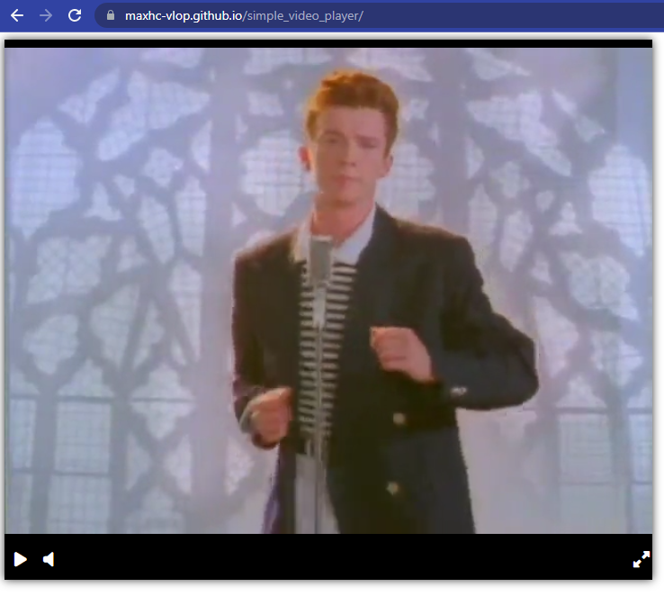

# Simple video player

Simple video player [prototype](https://maxhc-vlop.github.io/simple_video_player/) .



## How to install

- Сlone this repository:
```bash
git clone git@github.com:MaxHC-vlop/sending_notifications.git
```
- You must have python3.10 (or higher) installed .

- Install [poetry](https://python-poetry.org/docs/) :
```bash
pip install poetry
```
- Install project dependencies:
```bash
poetry install
```

## Run
```bash
poetry run python3 main.py
```
- You will see :
```bash
[I 230331 22:40:57 server:335] Serving on http://127.0.0.1:5500
[I 230331 22:40:57 handlers:62] Start watching changes
[I 230331 22:40:57 handlers:64] Start detecting changes
```